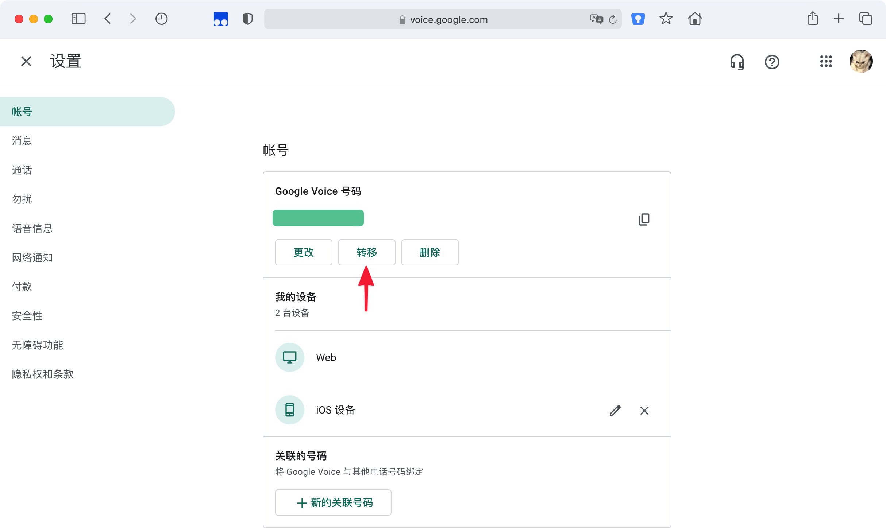
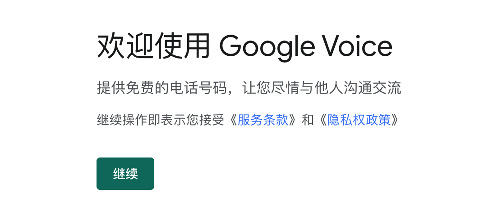

# Google Voice 转移到其他 Google 账户下

登录 [Google Voice](https://voice.google.com/u/0/messages)，点按右上角齿轮按钮，再点按【转移】。

点按【Transfer】。

点按【Sign-in to another account】登录其他账户。

登陆转入 Google 账户，点按【Transfer】。

选择新 Google 邮箱并点按【Transfer】。

> 【注】如果邮箱是灰色无法勾选，登录转入 Google Voice 账户，点按继续（如下图），再切换回去即可转移。

Google Voice 转移完成。

