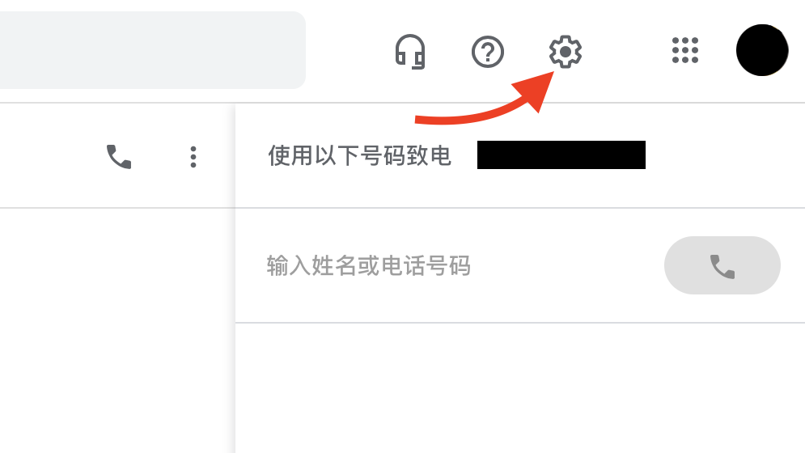
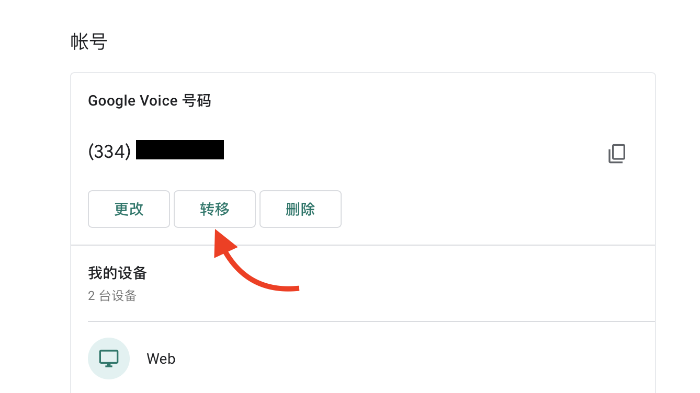
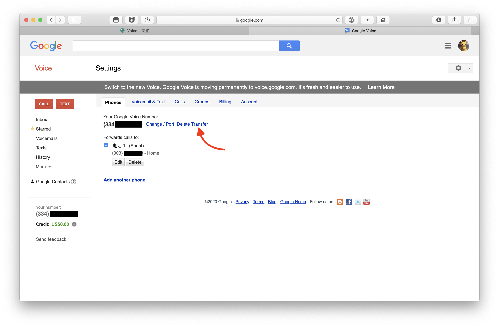
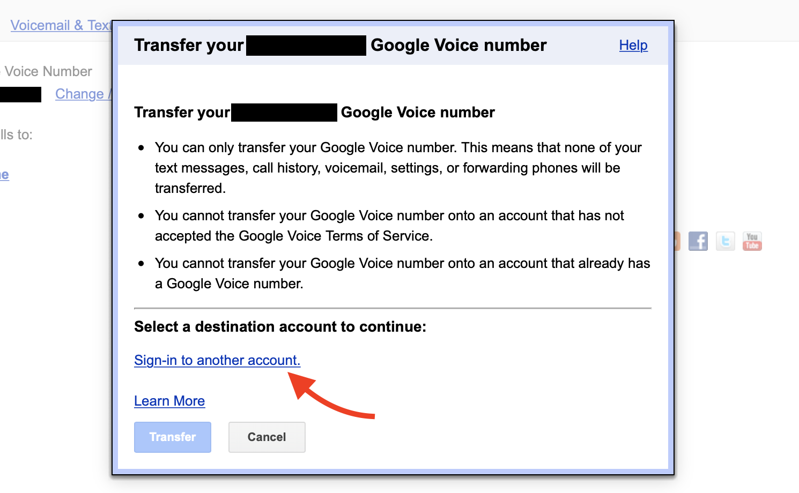
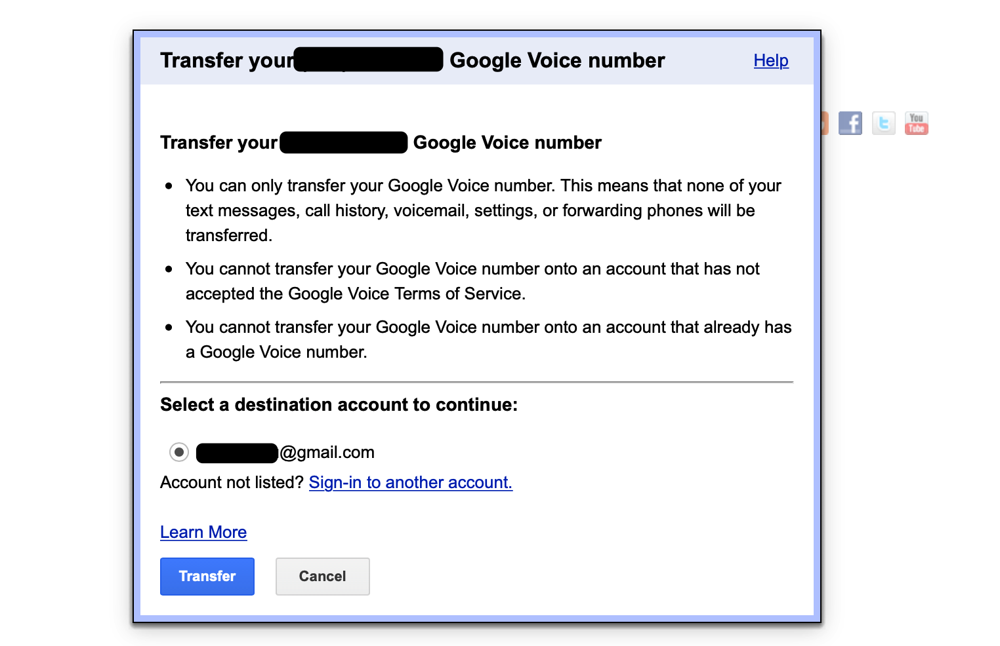
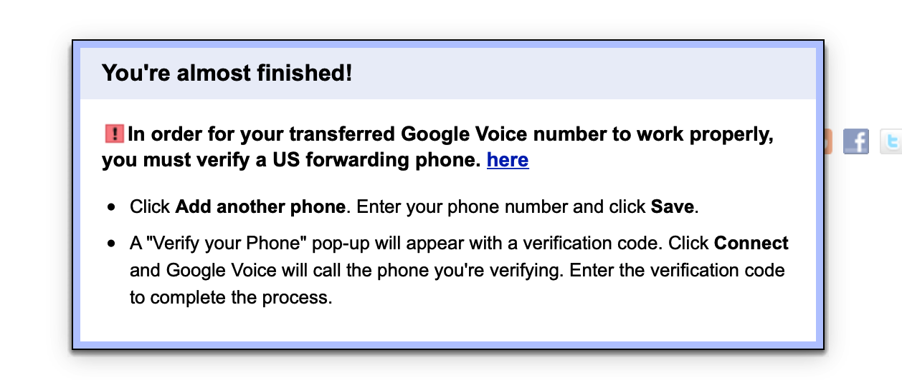

# Google Voice 转移到其他 Google 账户下

使用购买好的 Google 帐号登录[Google Voice](https://voice.google.com/u/0/messages)，点击右上角设置按钮。

点击「转移」。

点击「Transfer」。

点击「Sign-in to another account」。

登陆新 Google 账户，点击「Transfer」。

选择新 Google 邮箱，点击「Transfer」，完成操作。

> 注：两个 Google 账户需要同时在线。

提示下图表示 Google Voice 已经成功转入新 Google 账户内。

