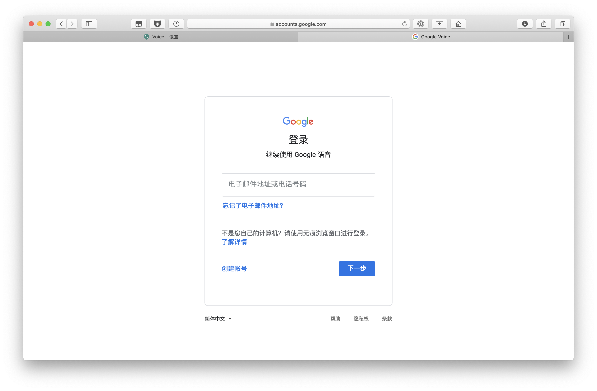

# Google Voice 转移到其他 Google 账户下

1. 打开 [Google Voice](https://voice.google.com/u/0/messages)，点击右上角设置按钮。
   
   

2. 点击「转移」。

3. 点击「Transfer」。

4. 点击「Sign-in to another account」。

5. 登陆新 Google 账户。

6. 点击「Transfer」。

7. 选择新 Google 邮箱，点击「Transfer」，完成操作。

> 两个 Google 账户需要同时在线。

提示下图表示 Google Voice 已经成功转入新 Google 账户内。

---

### Telegram

* 软路由交流群：[https://t.me/ruanluyoujiaoliu](https://t.me/ruanluyoujiaoliu)
* 硬路由交流群：[https://t.me/yingluyou](https://t.me/yingluyou)
* V2EX交流群：[https://t.me/V2EXPro](https://t.me/V2EXPro)
* macOS交流群：[https://t.me/macOSjiaoliu](https://t.me/macOSjiaoliu)
* Google产品交流：[https://t.me/Googlejiaoliuqun](https://t.me/Googlejiaoliuqun)

如果对你有帮助，欢迎支付宝扫码支持！

